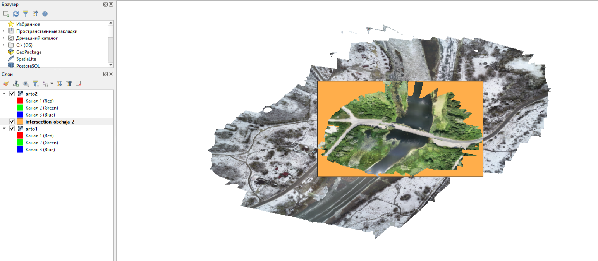
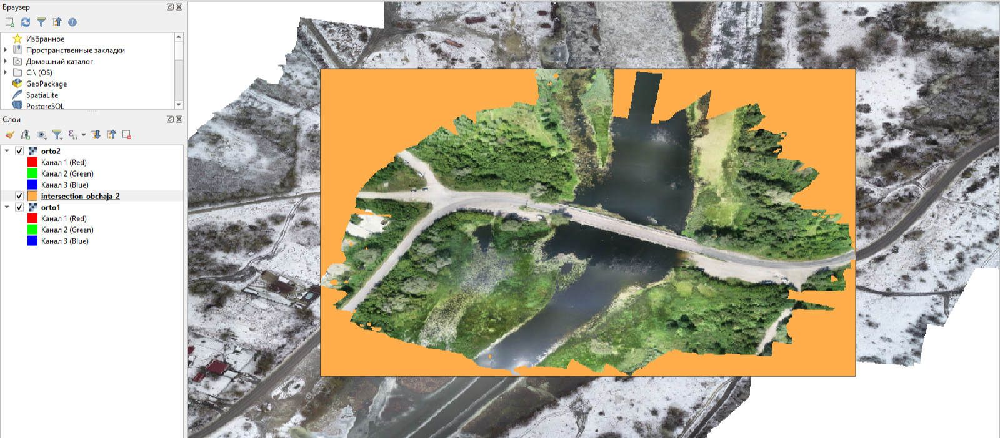
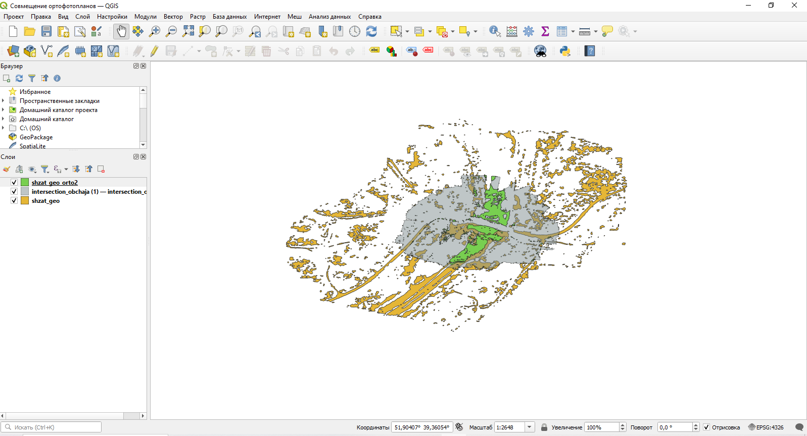
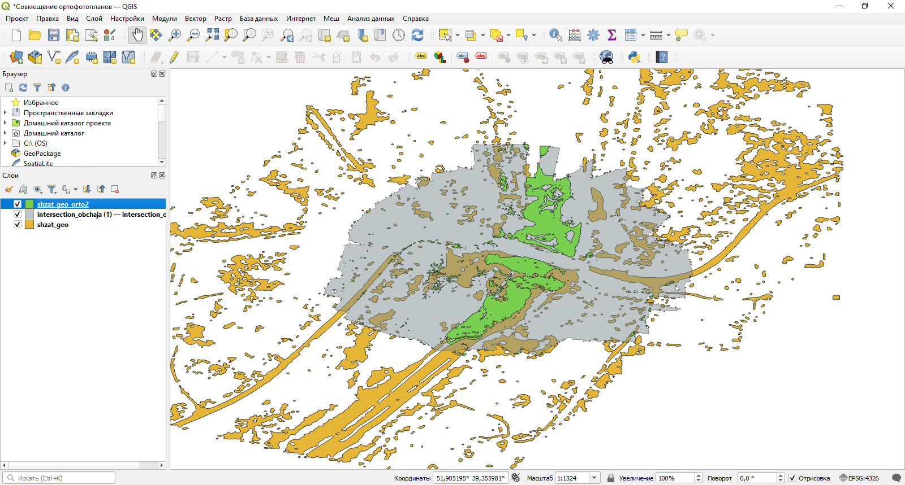

# Geospatial-Data-Overlap
Демонстрация наработок по определению области перекрытий на геопространственных изображениях

## Нормализация области сравнения тождественных ортофотопланов для выделения полигона области пересечения в формате .geojson на языке C++

*C++ - Область пересечения двух растров*

*C++ - Область пересечения двух растров в приближении*

## Вычленение общей зоны между двумя векторными полигонами разлива воды в формате .geojson на двух ортофотопланах на языке Python

*Python - Область пересечения двух растров*

*Python - Область пересечения двух растров в приближении*
